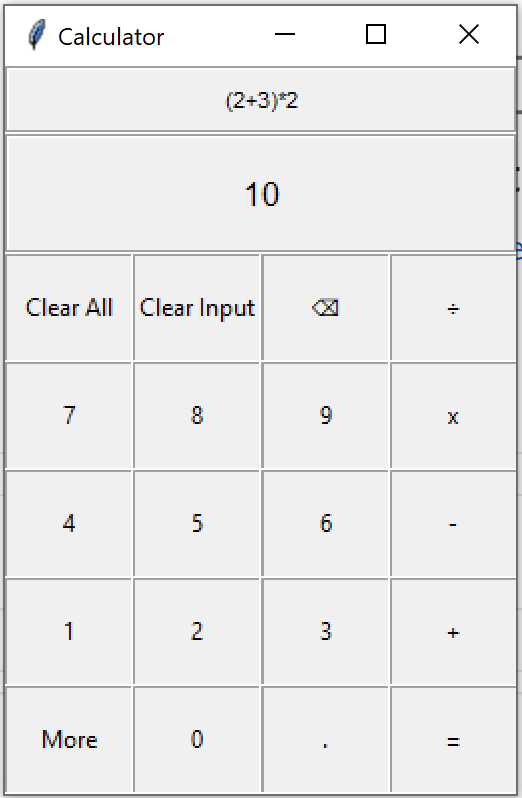

# Tkinter-Calculator
A basic calculator I made to learn how to use the Python Tkinter GUI package

This can be run through the console with python, or double clicked

I may revisit this later, the driving code isn't great, I made this when I was first learning python and trying to learn to use Tkinter.
